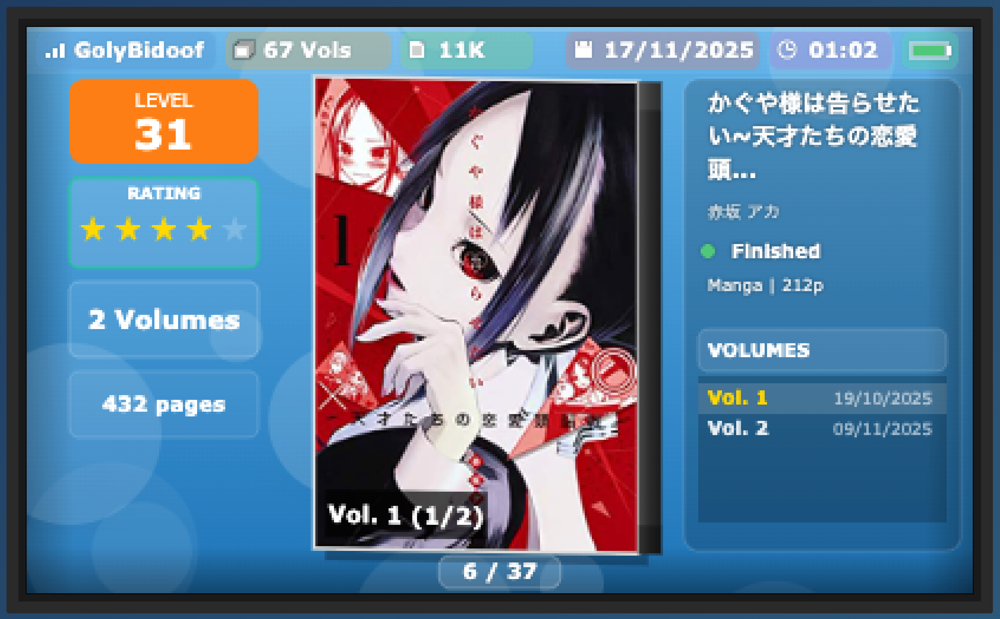

# Nintendo 3DS LearnNatively Tracker



A Nintendo 3DS-style interface for viewing your LearnNatively reading statistics.

## What it does

Displays your LearnNatively library in a 3DS home menu interface, showing book covers, ratings, reading progress, and series information with authentic 3DS animations and styling.

## Infrastructure

- **Frontend**: Static HTML/CSS/JavaScript hosted on GitHub Pages
- **Backend**: Node.js proxy server deployed on Railway
- **Data source**: LearnNatively API (requires authentication tokens)

## Structure

- `index.html` - Main interface
- `styles.css` - Styling
- `app.js` - Canvas rendering and API calls
- `server.js` - CORS proxy for LearnNatively API

## Token Management

Authentication tokens are hardcoded in `server.js` (lines 6-7). These expire monthly and need to be updated manually:

1. Get new tokens from LearnNatively cookies
2. Update `SESSION_TOKEN` and `CSRF_TOKEN` in `server.js`
3. Redeploy to Railway

## Cache Fallback

If the Railway backend fails or you stop paying, the site falls back to cached JSON files (`stats.json` and `library.json`). Update the cache by running:

```bash
./update-cache.sh
```

This will work as long as Railway is still running. Once Railway shuts down, you can manually update the JSON files with your latest reading data.

## Local Development

```bash
node server.js
```

The server runs on port 3000 and serves both the proxy endpoint and static files for local testing.
